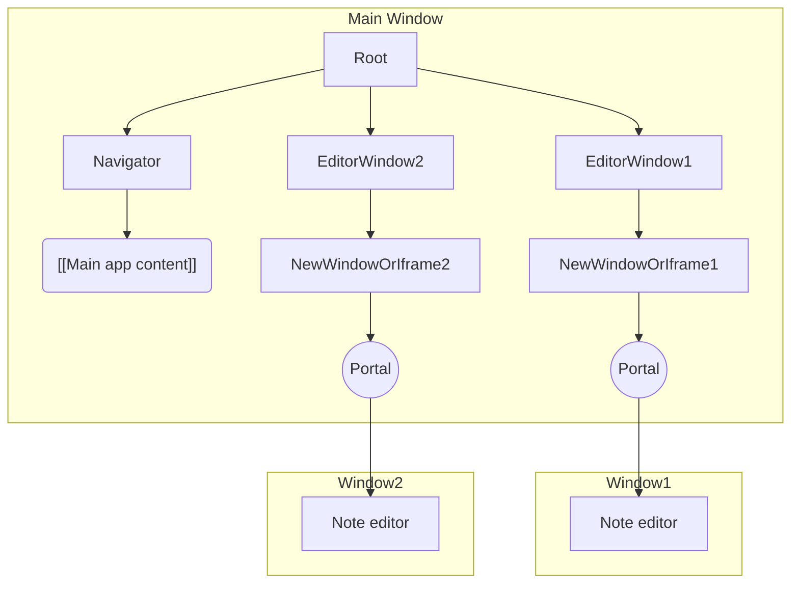

# Background windows

This document explains Joplin's multiple window support from a technical perspective.

## Reducer state

On desktop, Joplin supports multiple windows with the `backgroundWindows` reducer state. Each entry in `backgroundWindows` contains the state of a window that is in the background (not currently focused). The currently focused window's state is stored in the top-level state object.

### State structure

Suppose that there are three windows, `window1`, `window2`, and `window3`.

Initially, `window1` is focused and the state might look like this:
```js
state = {
	backgroundWindows: {
		window2: {
			windowId: 'window2',
			selectedNoteIds: ['id-of-the-note-selected-in-window2'],
			// ... other per-window properties ...
		},
		window3: {
			windowId: 'window3',
			selectedNoteIds: ['id-of-the-note-selected-in-window3'],
			// ... other per-window properties ...
		},
	},

	// <focused window state>
	windowId: 'window1',
	selectedNoteIds: ['id-of-the-note-selected-in-the-main-window'],

	// ... other per-window properties ...
	// </focused window state>

	// <shared state>
	settings: {...},
	profileConfig: {...},
	syncStatus: {...},
	// ... all shared properties ...
	// </shared state>
}
```

Notice that the state for the focused window is part of the main state object. This is for compatibility. Historically, Joplin only supported one window with at most one open editor. As a result, many commands assume that if `state.selectedNoteIds = ['some-id-here']`, then `state.selectedNoteIds[0]` is the ID of the note currently being edited. By storing the `selectedNoteIds` for the currently active window in the main `state` object, Joplin remains compatible with legacy commands and components.

### Switching windows

When the user switches from one window to another, a `WINDOW_FOCUS` action is sent to the reducer. The reducer responds by moving the old window's state to `backgroundWindows` and the new window's state to the main `state` object.

For example, if a user switches from `window1` to `window2`, the state change looks like this:
1. Initial state: `window2` is the only background window and `window1` is the foreground window.
   ```js
	state = {
		backgroundWindows: {
			window2: {
				windowId: 'window2',
				selectedNoteIds: ['note-in-window2'],
				// ... other per-window properties ...
			},
		},

		// <main window state>
		windowId: 'window1',
		selectedNoteIds: ['note-in-window1'],
	
		// ... other per-window properties ...
		// </main window state>

		// <shared state>
		// ... all shared properties ...
		// </shared state>
	}
	```
2. The reducer receives the `WINDOW_FOCUS` action and swaps which window state is in `backgroundWindows`. notice that only the window state is moved (the shared state is unmodified):
   ```js
	state = {
		backgroundWindows: {
			window1: {
				windowId: 'window1',
				selectedNoteIds: ['note-in-window1'],
				// ... other per-window properties ...
			},
		},

		// <main window state>
		windowId: 'window2',
		selectedNoteIds: ['note-in-window2'],
	
		// ... other per-window properties ...
		// </main window state>

		// <shared state>
		// ... all shared properties ...
		// </shared state>
	}
	```
	Window 2 is now the main window.

### Extra per-window state

Some per-window state is application specific. For example, the `devToolsVisible` property is **specific to the desktop app** and is different for each window (because each window can have its own dev tools).

This is supported by giving `backgroundWindows` a type with an extended set of properties in the desktop application's state.

When new windows are opened with the `WINDOW_OPEN` action, the default value for the new window-specific properties must be provided. For example, `{ devToolsVisible: false }`.

## Rendering components in new windows

The [react-dom portals API](https://react.dev/reference/react-dom/createPortal) allows a component to render its children in a different place. In this case, Joplin uses the portals API to render certain components in a new window, while keeping them in the same React component tree.

### Same React tree, different DOMs

The React portals API allows all editors to be descendants of the `<Root/>` component, while also being in a different HTML `document`:



This also means that components running in secondary windows (e.g. `Window1`, `Window2` above) are controlled by JavaScript in the main window. As a result,
- Closing the main window means that secondary windows must also be closed.
	- Hiding the window with `BrowserWindow.hide` is used instead.
- Component logic must be careful to reference the correct DOM. **Using the global `document` and `window` objects is often incorrect.**
	- Instead of the `document` global variable, use [`HTMLElement.ownerDocument`](https://developer.mozilla.org/en-US/docs/Web/API/Node/ownerDocument) (or the `useDom` hook).
	- Instead of `window`, use [`.defaultView`](https://developer.mozilla.org/en-US/docs/Web/API/Document/defaultView) on a [`Document`](https://developer.mozilla.org/en-US/docs/Web/API/Document) object.

### Getting the ID for the current window

Sometimes, it's necessary to get the Joplin ID of the current window. This ID allows referencing the state specific to a window in Joplin's reducer.

Suppose `<MyComponent>` could be displayed in any window of the app and we want to find the selected note IDs for its window. To do this:
1. Get the window ID. This can be done by either:
   - Passing it as a `prop`
   - With `useContext(WindowIdContext)`, where `WindowIdContext` is the context that provides the window ID. ([Documentation for `useContext`](https://react.dev/reference/react/useContext)).
2. Use the window ID to determine the current window state. To do this, use the window ID to look up the state for the current window (e.g. with `stateUtils.windowStateById`).
3. Get the `selectedNoteIds` from the window state.

## Limitations

- **All windows have the same menubar:** Currently, Joplin sets the application menubar with `Menu.setApplicationMenu`. This allows the menu to be updated later with `Menu.getApplicationMenu`, but means that all windows have the same menu.
	- An alternative might be to set menus on individual windows with [`BrowserWindow.setMenu`](https://www.electronjs.org/docs/latest/api/browser-window#winsetmenumenu-linux-windows), but this doesn't allow accessing the menu later (e.g. from Playwright) with `Menu.getApplicationMenu` and does not work on MacOS.
- **Certain UI only available on the main window:** At present, certain parts of the UI (e.g. sidebars, warning banners, etc.) are only visible on the main window.While this simplifies multi-window support by limiting which components need to work in secondary windows, it makes secondary windows more limited than primary windows.
