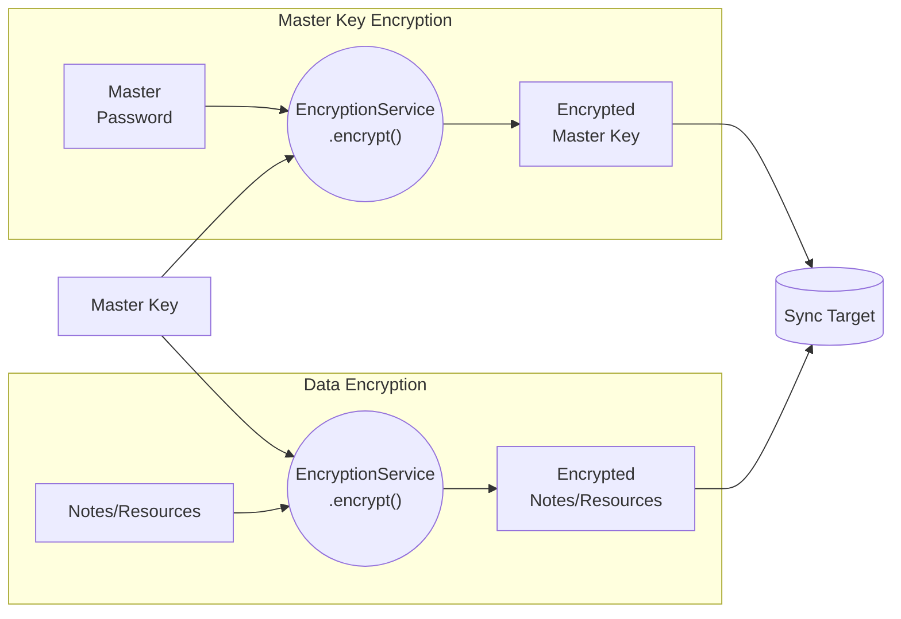
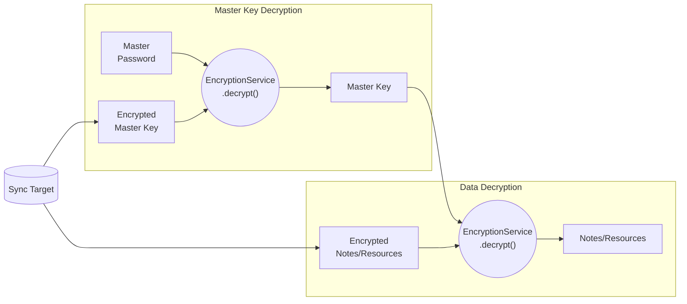
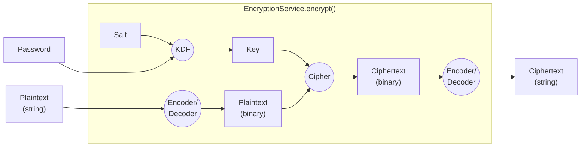
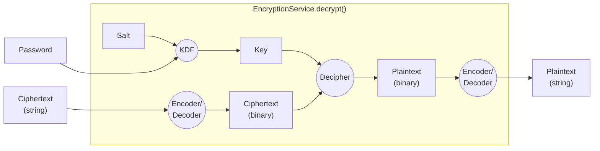
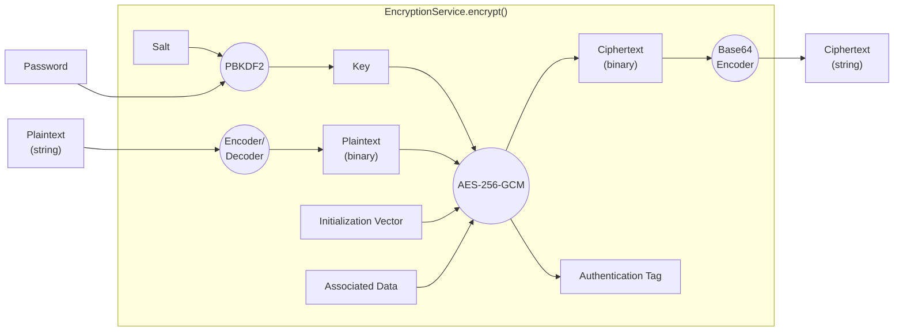
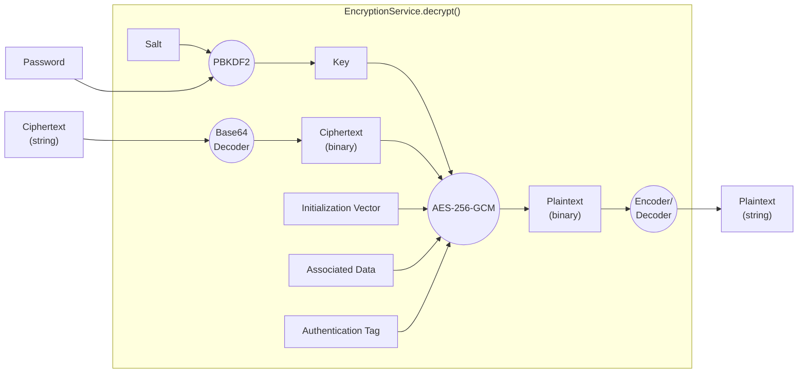

# Native Encryption Method Specification

Starting with Joplin v3.2, we introduced a series of new encryption methods. These methods are built on native libraries and are designed to enhance both performance and security. This document provides an overview and detailed specifications of these new encryption methods.  

**Related Links:**  
[GitHub Pull Request](https://github.com/laurent22/joplin/pull/10696)  
[GSoC Final Report](https://discourse.joplinapp.org/t/final-report-of-the-native-encryption-project/40171)  

## 1. General Steps for Encryption/Decryption
### 1.1. Encryption Steps:


### 1.2. Decryption Steps: 

### 1.3. Explanations
- **Master Password**: The user-provided password used to encrypt the Master Key.
- **Master Key**: A randomly generated 256-byte (2048-bit) key used to encrypt notes and resources. This is also called the `Data Key` in [this document](https://github.com/laurent22/joplin/blob/dev/readme/dev/spec/e2ee/workflow.md).
- **Master Key Encryption/Decryption**: In these parts, the Master Key is encrypted or decrypted using the Master Password.
- **Data Encryption/Decryption**: In these parts, notes and resources are encrypted or decrypted using the Master Key.

The Master Password is stored locally in the database and is never updated to the Sync Target. As a result, third-party Sync Targets cannot decrypt the Master Key, notes or resources.  

## 2. General Implementation for `encrypt()` and `decrypt()`
### 2.1. encrypt():

### 2.2. decrypt():

### 2.3. Explanations
(In this section, `encrypt()` and `decrypt()` refer to `EncryptionService.encrypt()` and `EncryptionService.decrypt()` respectively.)  
- **KDF**: Key Derivation Function, used to derive cryptographically strong keys from passwords.
- **Encoder/Decoder**: The `encrypt()` and `decrypt()` methods take strings as input and produce strings as output. Since the cipher operates on binary data and generates binary outputs, encoders and decoders are used to convert between strings and binary data.
- **KDF (Key Derivation Function)**: The `encrypt()` and `decrypt()` methods are designed for password-based encryption, but passwords may not meet cryptographic key strength requirements. The KDF addresses this by taking a password and a salt as inputs and generating a secure cryptographic key for the actual encryption process.
- **Salt**: The salt is managed internally by the `encrypt()` and `decrypt()` methods (or more generally, within the `EncryptionService`), so callers don't need to handle it explicitly.
## 3. Specifications for the New Native Encryption Methods
### 3.1. Encryption Flow
The expanded flow is shown below. Some of the elements have been replaced with the specific implementation compared with the general implementation graphs. Additionally, extra elements have been introduced for the chosen cipher.  

### 3.2. Decryption Flow
The decryption flow is similar to the encryption flow.  

### 3.3. Encoder/Decoder
Different encoders/decoders are used for different types of plaintext:  

| Method Name | Plaintext Type | Encoder |
|---|---|---|
| KeyV1 | Master Key | Hex String Decoder |
| StringV1 | Note Content | UTF-16 Encoder |
| FileV1 | Resources (Files) | Base64 String Decoder |

- For `KeyV1` and `FileV1`, the plaintext is initially binary but is encoded as strings to work with `encrypt()` and `decrypt()`, which operate only on strings. Before encryption, a proper decoder converts these strings back to their original binary form. This resolves the double Base64 encoding issue in the old encryption methods, resulting in smaller ciphertext.
- For `StringV1`, UTF-16 encoding ensures compatibility with all possible JavaScript characters.

### 3.4. PBKDF2 Parameters
PBKDF2 is used as the KDF for its compatibility across all platforms. The parameters are listed below:  

<table>
    <tbody>
        <tr>
            <td>Method Name</td><td>Algorithm</td><td>Iteration Count</td><td>Salt</td><td>Output Key Length</td>
        </tr>
        <tr>
            <td>KeyV1</td>
            <td rowspan="3">PBKDF2-HMAC-SHA512</td>
            <td>220000</td>
            <td rowspan="3">256-bit Generated Salt</td>
            <td rowspan="3">256 Bits</td>
        </tr>
        <tr>
            <td>StringV1</td>
            <td rowspan="2">3</td>
        </tr>
        <tr>
            <td>FileV1</td>
        </tr>
    </tbody>
</table>

The iteration count of `KeyV1` follows [OWASP recommendations](https://cheatsheetseries.owasp.org/cheatsheets/Password_Storage_Cheat_Sheet.html#pbkdf2). For `StringV1` and `FileV1`, the randomly generated Master Key already provides sufficient cryptographic strength so the low iteration count is acceptable.  
However, applying the KDF to the Master Key is still necessary to resolve the short IV problem in the AES-GCM cipher. The details are provided in [Section 3.6](#36-extended-equivalent-nonce).  

### 3.5. Cipher/Decipher Parameters
The parameters for the cipher `AES-256-GCM`, used in all three new encryption methods (`KeyV1`, `StringV1`, `FileV1`), are listed below:  

| Parameter | Value |
|---|---|
| Cipher/Decipher | AES |
| Mode | GCM |
| Key Length | 256 Bits |
| Initialization Vector | 96-bit Random Bytes |
| Associated Data | (Empty) |
| Authentication Tag Length | 128 Bits |

The Initialization Vector (IV) length is set to 96 bits because extending it doesn't improve the cryptographic strength. Actually, the low-level implementation of AES-GCM always reduces longer IVs to 96 bits.  

### 3.6. Extended Equivalent Nonce
Although AES-GCM has been used in TLS for years and has not shown significant vulnerabilities, there are still some security considerations:  
- The Galois Counter Mode (GCM) is vulnerable when the IV and key is reused.
- While a simple counter could serve as the IV, it's not easy to maintain a reliable monotonic counter across all clients.
- The AES-GCM cipher has a maximum IV length of 96 bits (as discussed in Section 3.5), which is relatively short.

Although unlikely, a Joplin user could run into two pieces of ciphertext encrypted with the same IV even if the IV is randomly generated. This cause security vulnerabilities if the notes and resources is encrypted with the same Master Key directly. To resolve this, a 256-bit generated salt is used for each encryption to derive a new encryption key from the Master Key, so the key passed to the cipher changes every time. In theory, this approach provides a equivalent nonce with a length of (256+96) bits.  

The salt is generated using the following formula:  
```
encryptionNonce = concat(<168-bit Random Data>, <64-bit Timestamp in ms>, <56-bit Counter Value>)
salt = sha256(encryptionNonce)
```
- The `encryptionNonce` is generated when the app starts or when the 56-bit counter overflows.
- The counter increases with each encryption operation.

## 4. Dependencies
- **Desktop/CLI Client**: `Web Crypto API` provided by Node.js
- **Web Client**: `Web Crypto API` provided by the browsers
- **Mobile Client**: `react-native-quick-crypto`
